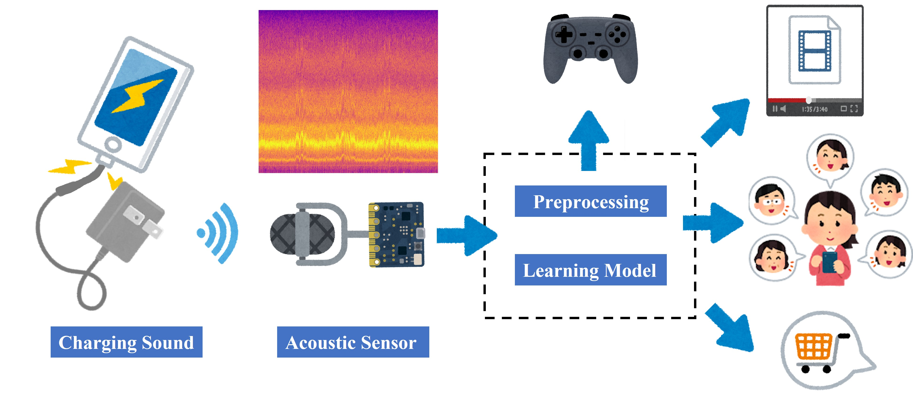

# ASiA: Acoustic Side-channel Attack for smartphone charging

## Wired Charging: Inferring Smartphone Application Types via Inaudible Charging Sound (IEEE SMC '25 Best Paper Nominee)
The relevant paper is at: https://ieeexplore.ieee.org/abstract/document/11342983 

DOI: 10.1109/SMC58881.2025.11342983

If you use the Wired Charging SCA dataset in an academic work, please cite:
```
@INPROCEEDINGS{11342983,
  author={Meng, Junchen and Yang, Zhe and Zhang, Xiaoli and Zhu, Huaiyu},
  booktitle={2025 IEEE International Conference on Systems, Man, and Cybernetics (SMC)}, 
  title={Inferring Smartphone Application Types via Inaudible Charging Sound: A New Acoustic Side-channel Attack}, 
  year={2025},
  volume={},
  number={},
  pages={6301-6306},
  keywords={Training;Representation learning;Privacy;Accuracy;Side-channel attacks;Transformers;Acoustics;Stability analysis;Security;Protection},
  doi={10.1109/SMC58881.2025.11342983}}
```

### Datasets
The data are at: https://zenodo.org/records/19236302
### Recording Specifications 
- **Sampling Rate**: 192 kHz (high-fidelity acoustic capture)
- **Recording**: Continuous full-session audio (no pre-sliced segments; slicing done during preprocessing)
- **Format**: WAV (uncompressed)
- **Microphone**: Double X0 pickup microphone
- **Battery Level**: All recordings at 100% capacity
- **Environment**: Controlled ambient conditions for reproducible acoustic feature extraction
### Device Specifications
 Smartphones:
- **Redmi Note 12T**: Mid-range Android device
- **Huawei Nova 6**: Legacy device for cross-generational analysis
Chargers:
- **Xiaomi 67W Charger**: Fast charging (QC/PD protocols)
- **Ugreen Dual-Port 20W**: Baseline charging (17W single-port mode)
### Application Categories
| Category                | Applications                                       | Protocol                              |
| ----------------------- | -------------------------------------------------- | ------------------------------------- |
| **Games**         | Minecraft, Sky: Children of the Light, PUBG Mobile | 3D scene navigation and gameplay      |
| **Social**        | QQ, DingTalk                                       | Text messaging and transmission       |
| **Entertainment** | Douyin (TikTok), Kuaishou (Kwai)                   | Video playback with content switching |
| **Shopping**      | JD, Pinduoduo                                      | Product browsing and selection        |

### File Structure
```
dataset/
├── 01.wav ~ 36.wav    # Audio recordings
└── labels.json        # Metadata with app names and device info
```

Each entry in `labels.json` contains:

```json
{
  "app_name": "Application name",
  "device": {
    "phone": "Smartphone model",
    "charger": "Charger specification"
  }
}
```


## Wireless Charging: Will be available soon...
